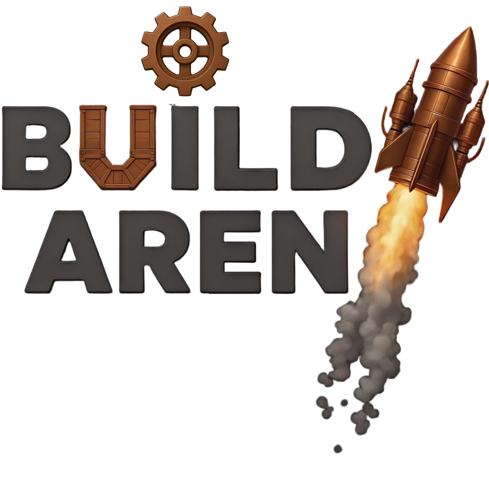
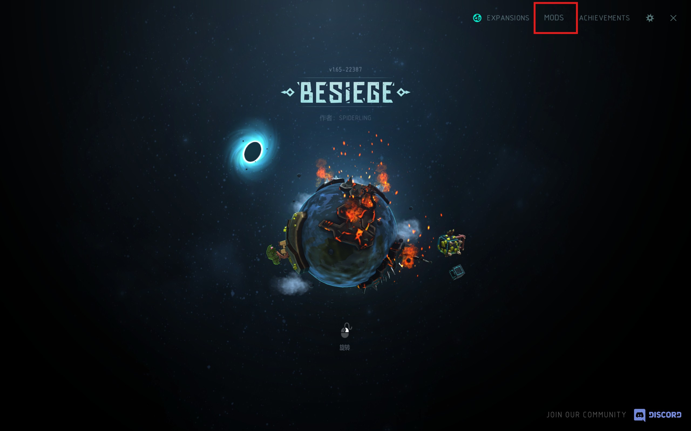
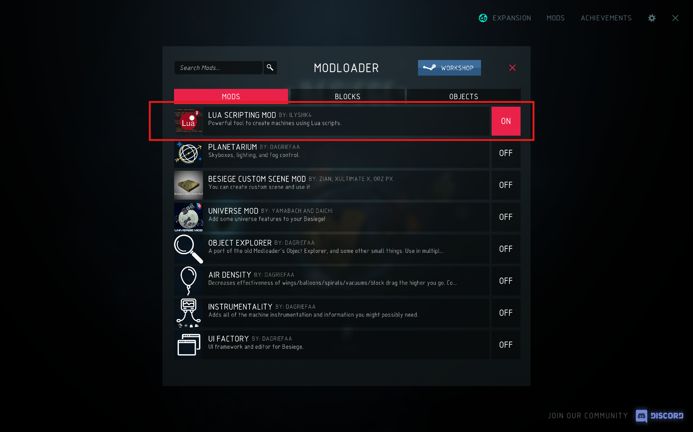
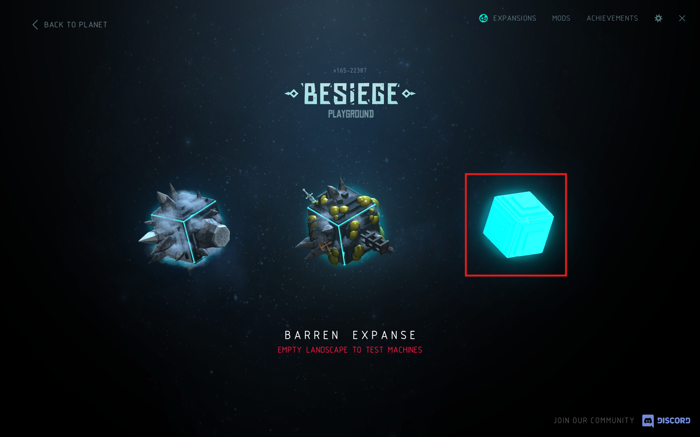
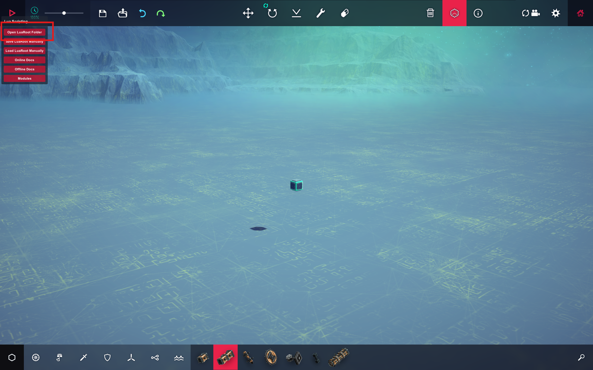
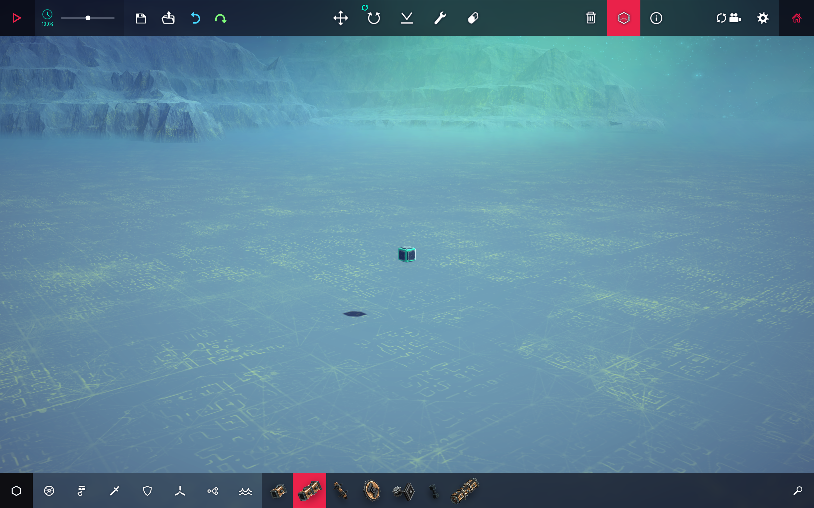

<p align="center">
  
</p>

<h1 align="center">Build Arena</h1>

<p align="center">
  <strong>The First Physics-Aligned Interactive Benchmark for Language-Driven Engineering Construction</strong>
</p>

<p align="center">
  <a href="https://github.com/build-arena/build-arena.github.io"></a>
  <a href="https://github.com/AI4Science-WestlakeU/BuildArena"></a>
  <a href="https://build-arena.github.io/"></a>
  <a href="https://store.steampowered.com/app/346010/"></a>
</p>

<p align="center">
  
  
  
</p>

---

## 🙏 Special Thanks

We are grateful to [Spiderling Studios](https://store.steampowered.com/app/346010/) for creating **Besiege**, the inspiring physics sandbox that underpins our work. We also thank the developers of the open-source projects [Lua Scripting Mod](https://steamcommunity.com/sharedfiles/filedetails/?id=2383785201) and [Besiege Creation Import Addon for Blender](https://github.com/lelandjansen/besiege-creation-importer) for their valuable contributions to the community.

We also gratefully acknowledge the support of **Westlake University Research Center for Industries of the Future**.

---

## 📅 Timeline

- **2025-10-17** 🚀 Repository launched with baseline implementation
- **Coming Soon** 📄 Preprint paper release
- **Ongoing** 🔧 Active development and code updates

> **Status:** We are actively developing and improving the codebase. Stay tuned for the preprint paper release and continuous updates!

---

## Installation

Install [uv](https://github.com/astral-sh/uv) following the official guidance. 

Synchronize the virtual environment:
```bash
uv sync
```

Create a ``config.py`` file, copy and edit the content below:
```python
# Path of the directory where all the machines will be saved as BSG files
# SavedMachines of the Besiege game (you can find it in the Steam) is recommended
SavedMachines = "/path/to/Besiege/Contents/SavedMachines"

# API keys for the LLMs
# Leave an API_KEY as it is if it's not provided by you
API_KEY_OAI = "<Your OpenAI API key>"
API_KEY_DS = "<Your DeepSeek API key>"
API_KEY_ANT = "<Your Anthropic API key>"
API_KEY_ARC = "<Your Arc API key>"
API_KEY_XAI = "<Your XAI API key>"
API_KEY_MS = "<Your Moonshot API key>"
API_KEY_ALI = "<Your Aliyun API key>"
API_KEY_GOOGLE = "<Your Google API key>"

# Automation clicking fractional position: (x: horizontal from left 0 to right 1, y: vertical: from top 0 to bottom 1)
# POS_OPEN_FOLDER: Open the folder to load the machine, a button on the left part of the top column
POS_OPEN_FOLDER = (0.202, 0.035)
# POS_ENTER_NAME: The machine name entering frame
POS_ENTER_NAME = (0.476, 0.215)
# POS_OPEN_MACHINE: Open the machine button, on the right side of the machine name input box
POS_OPEN_MACHINE = (0.638, 0.209)
# POS_SET_GROUND: Set the ground button, on the middle of the top column
POS_SET_GROUND = (0.403, 0.0185)
# POS_LOG_WINDOW: The position of the Lua scripting log window, on the right side of the Lua panel
POS_LOG_WINDOW = (0.185, 0.172)
# POS_EMPTY_SPACE: An arbitrary position with no button or machine to click for resetting the UI
POS_EMPTY_SPACE = (0.034, 0.726)
# POS_START_SIMU: The start button on the upper left corner
POS_START_SIMU = (0.021, 0.016)
# POS_DELETE: The delete button for deleting the entire machine
POS_DELETE = (0.707, 0.038)
# POS_CONFIRM: The yes confirmation button after clicking the delete button
POS_CONFIRM = (0.538, 0.586)
```

## Usage

### 3D Spatial Computation Library
[intro.ipynb](intro.ipynb) provides detailed introduction and demonstration of library's functions.

### Construction Process with Default Tasks:
1. Construction process runs independently without the [Besiege](https://store.steampowered.com/app/346010/Besiege/).

2. Task details of different categories and levels can be found in [levels.yaml](levels.yaml).

3. Run the [run_construction.py](script/run_construction.py) to start construction process, for example:
```bash
uv run -m script.run_construction --model gpt-4o --category transport --level soft --n_sample 64 --n_worker 4
```

4. You can monitor the process status in ``datacache/{category}_{level}_{model}_{timestamp}/task_database.db``.

5. The construction result ``BSG`` files can be imported into the Besiege game for viewing.

### Simulation Process with Default Tasks:
1. This repository DOES NOT contain the Besiege (a commercial software), which is required for simulation. The simulation scripts are only tested and verified on Windows.

2. We suggest buying the game [Besiege](https://store.steampowered.com/app/346010/Besiege/) through [Steam](https://store.steampowered.com/) platform.

3. Subscribe the [Lua Scripting Mod](https://steamcommunity.com/sharedfiles/filedetails/?id=2383785201&searchtext=Lua) through Steam Besiege Workshop. The Steam will automatically download the mod and update the game, restart the game if you opened it already.

4. Right-click the game and choose to open local file folder, find the SavedMachine folder and put it's path to your ``config.py``, so the saved machine can be accessed in the game.

5. Start the game, make sure the Lua Scripting Mod is activated.



6. Enter the last sandbox on the right, press ``ctrl+L`` to make sure Lua Scripting Mod panel can be shown and move it a little bit to ensure it does not block the start button.



7. Change the position constants in the ``config.py``. We provide a tool for finding the fractional coordinates of the cursor:
```bash
# run the script
uv run scripts/find_coords.py
```
Use `p` to print the coordinates and `q` to quit, and you can find the coordinates in the terminal output.

8. Press ``ctrl+L`` again to hide the Lua Scripting Mod panel, this is the starting status of the game for simulation.


9. If you are about to run a Support category simulation, copy three Besiege level ``BLV`` files in the [asset/](asset) into ``CustomLevels`` directory of the game, and open the corresponding level in the Level Editor of the game.

10. Run the [run_simulation](script/run_simulation.py) with a finished construction database:
```bash
uv run -m script.run_simulation --db path/to/simulation_database.db
```

### Analysis

1. Construction process analysis script is provided as [sampling_path_analysis.py](analyze/sampling_path_analysis.py), which compute the cost data each construction sample in a finished database:
```bash
uv run -m analyze.sampling_path_analysis db_path path/to/task_database.db
```
2. Simulation trajectory analysis scripts are provided in the [analyze/](analyze/), which determine if the machine passed the success criteria and compute the performance indicators:
```bash
uv run -m analyze.sim_common --csv_path path/to/simulation/trajectory.csv
```

### Customization:

#### Customized LLM:
We provide several model clients using Autogen in the [__init__.py](agents/__init__.py), you can add more following the same manner.

#### Customized Tasks:
You can add new tasks by editing the [levels.yaml](levels.yaml), the new task must also have category and level attribute so the construction process script can work properly.
#### Customized Simulation:

1. Simulation preprocessing scripts for our default tasks and automation script [operations.py](simulation/operations.py) are provided in [simulation/](simulation).

2. You can create your own preprocess script following these examples, and modify the router function ``run_simulation`` in the [runner.py](scheduler/runner.py) to use it.

3. If specialized game level is needed, you can create a Besiege Level ``BLV`` file using the Level Editor in the game.

#### Customized Analysis:
You can create your own simulation data analysis script following examples in the [analyze/](analyze/) and modify the router function ``route_simulation_analysis`` in the [sim_common.py](analyze/sim_common.py) accordingly.