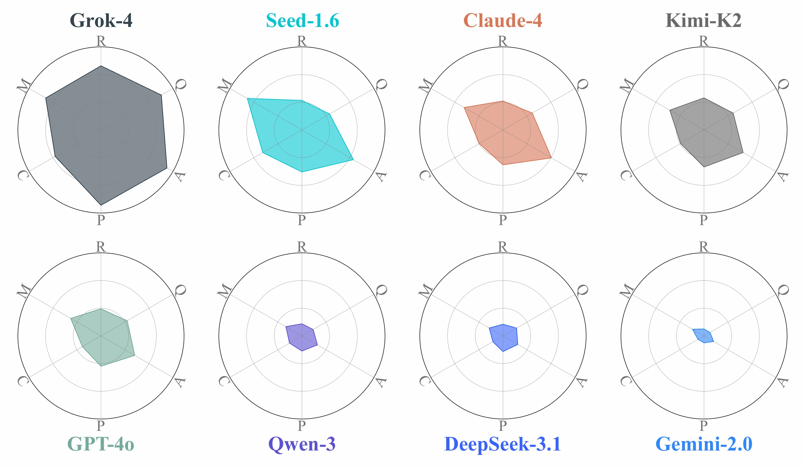

<p align="center">
  
</p>

<h1 align="center">Build Arena</h1>

<p align="center">
  <strong>The First Physics-Aligned Interactive Benchmark for Language-Driven Engineering Construction</strong>
</p>

<p align="center">
  <a href="https://arxiv.org/abs/2510.16559"></a>
  <a href="https://github.com/AI4Science-WestlakeU/BuildArena"></a>
  <a href="https://build-arena.github.io/"></a>
  <a href="https://store.steampowered.com/app/346010/"></a>
</p>

<p align="center">
  
  
  
</p>

---

## 🙏 Special Thanks

We are grateful to [Spiderling Studios](https://store.steampowered.com/app/346010/) for creating **Besiege**, the inspiring physics sandbox that underpins our work. We also thank the developers of the open-source projects [Lua Scripting Mod](https://steamcommunity.com/sharedfiles/filedetails/?id=2383785201) and [Besiege Creation Import Addon for Blender](https://github.com/lelandjansen/besiege-creation-importer) for their valuable contributions to the community.

We also gratefully acknowledge the support of **Westlake University Research Center for Industries of the Future**.

---

## 📅 Timeline

- **2025-10-17** 🚀 Repository launched with baseline implementation
- **2025-10-20** 📄 Preprint paper released on arXiv: [2510.16559](https://arxiv.org/abs/2510.16559)
- **Ongoing** 🔧 Active development and code updates

> **Status:** We are actively developing and improving the codebase. Stay tuned for the continuous updates!

---

## 🏆 Performance Leaderboard

We evaluate eight frontier large language models on Build Arena across three task categories (**Transport**, **Support**, **Lift**) and three difficulty levels (Lv.1 Easy, Lv.2 Medium, Lv.3 Hard) under our baseline agentic workflow. Performance is measured by success rate, with **64 samples per task-model pair** to ensure statistical reliability.

| Rank | Model | Full Model Name | Transport<br>Avg Success Rate | Support<br>Avg Success Rate | Lift<br>Avg Success Rate | Overall Performance |
|:----:|-------|----------------|:-----------------------------:|:---------------------------:|:------------------------:|:-------------------:|
| 🥇 | **Grok-4** | grok4-0709 | **11.5%** | **20.8%** | **21.9%** | **Excellent** |
| 🥈 | **Claude-4** | claude-sonnet-4-20250514 | 12.5% | 3.1% | 4.2% | Good |
| 🥉 | **Seed-1.6** | doubao-seed-1-6-250615 | 6.2% | 19.3% | 2.1% | Good |
| 4 | **GPT-4o** | gpt-4o | 6.2% | 13.5% | 3.6% | Moderate |
| 5 | **Kimi-K2** | kimi-k2-turbo-preview | 4.7% | 11.5% | 5.2% | Moderate |
| 6 | **Qwen-3** | qwen-plus (Qwen3 series) | 5.7% | 5.7% | 1.0% | Moderate |
| 7 | **DeepSeek-3.1** | deepseek-chat (DeepSeek-V3.1) | 2.6% | 8.3% | 3.6% | Moderate |
| 8 | **Gemini-2.0** | gemini-2.0-flash | 1.6% | 7.8% | 0.0% | Moderate |

> *Success rates are averaged across all three difficulty levels (Lv.1, Lv.2, Lv.3) for each task category under our baseline agentic workflow. Full model snapshots and detailed experimental setup are available in the paper appendix.*

### Multi-Dimensional Performance Analysis

<p align="center">
  
</p>

<p align="center">
  <em>Figure: Performance of different LLMs against six dimensions of task difficulty: <strong>Quantification (Q)</strong>, <strong>Robustness (R)</strong>, <strong>Magnitude (M)</strong>, <strong>Compositionality (C)</strong>, <strong>Precision (P)</strong>, <strong>Ambiguity (A)</strong>.</em>
</p>

---

## 📦 Installation

### Step 1: Install uv Package Manager

Install [uv](https://github.com/astral-sh/uv) following the official guidance.

### Step 2: Synchronize Virtual Environment

```bash
uv sync
```

### Step 3: Configure API Keys and Paths

Create a `config.py` file in the project root directory with the following content:

> **💡 Tip:** For the UI position coordinates below, you can keep the default values for now. Later, when you need to run simulations, we provide a convenient `find_coords` tool to help you calibrate these positions for your specific screen setup (see [Step 6 in Simulation Process](#6-calibrate-ui-positions-optional)).

```python
# Path of the directory where all the machines will be saved as BSG files
# SavedMachines of the Besiege game (you can find it in the Steam) is recommended
SavedMachines = "/path/to/Besiege/Contents/SavedMachines"

# API keys for the LLMs
# Leave an API_KEY as it is if it's not provided by you
API_KEY_OAI = "<Your OpenAI API key>"
API_KEY_DS = "<Your DeepSeek API key>"
API_KEY_ANT = "<Your Anthropic API key>"
API_KEY_ARC = "<Your Arc API key>"
API_KEY_XAI = "<Your XAI API key>"
API_KEY_MS = "<Your Moonshot API key>"
API_KEY_ALI = "<Your Aliyun API key>"
API_KEY_GOOGLE = "<Your Google API key>"

# Automation clicking fractional position: (x: horizontal from left 0 to right 1, y: vertical: from top 0 to bottom 1)
# You can keep these default values and calibrate them later using the find_coords tool
# POS_OPEN_FOLDER: Open the folder to load the machine, a button on the left part of the top column
POS_OPEN_FOLDER = (0.202, 0.035)
# POS_ENTER_NAME: The machine name entering frame
POS_ENTER_NAME = (0.476, 0.215)
# POS_OPEN_MACHINE: Open the machine button, on the right side of the machine name input box
POS_OPEN_MACHINE = (0.638, 0.209)
# POS_SET_GROUND: Set the ground button, on the middle of the top column
POS_SET_GROUND = (0.403, 0.0185)
# POS_LOG_WINDOW: The position of the Lua scripting log window, on the right side of the Lua panel
POS_LOG_WINDOW = (0.185, 0.172)
# POS_EMPTY_SPACE: An arbitrary position with no button or machine to click for resetting the UI
POS_EMPTY_SPACE = (0.034, 0.726)
# POS_START_SIMU: The start button on the upper left corner
POS_START_SIMU = (0.021, 0.016)
# POS_DELETE: The delete button for deleting the entire machine
POS_DELETE = (0.707, 0.038)
# POS_CONFIRM: The yes confirmation button after clicking the delete button
POS_CONFIRM = (0.538, 0.586)
```

> **Note:** Replace all placeholder values (paths and API keys) with your actual configuration.

---

## 🚀 Usage

### 📚 3D Spatial Computation Library

The [intro.ipynb](intro.ipynb) notebook provides a detailed introduction and demonstration of the library's spatial computation functions.

---

### 🏗️ Construction Process with Default Tasks

> **Note:** The construction process runs independently without requiring the Besiege game.

**1. Task Configuration**

Task details for different categories and levels can be found in [levels.yaml](levels.yaml).

**2. Start Construction**

Run the [run_construction.py](script/run_construction.py) script to start the construction process:

```bash
uv run -m script.run_construction \
  --model gpt-4o \
  --category transport \
  --level soft \
  --n_sample 64 \
  --n_worker 4
```

**3. Monitor Progress**

You can monitor the process status in the task database:
```
datacache/{category}_{level}_{model}_{timestamp}/task_database.db
```

**4. View Results**

The construction result `BSG` files can be imported into the Besiege game for viewing.

---

### 🎮 Simulation Process with Default Tasks

> **⚠️ Important:** This repository DOES NOT contain Besiege (a commercial software), which is **required** for simulation. The simulation scripts are only tested and verified on **Windows**.

**1. Purchase and Install Besiege**

Purchase the game [Besiege](https://store.steampowered.com/app/346010/Besiege/) through the [Steam](https://store.steampowered.com/) platform.

**2. Install Lua Scripting Mod**

Subscribe to the [Lua Scripting Mod](https://steamcommunity.com/sharedfiles/filedetails/?id=2383785201&searchtext=Lua) through Steam Besiege Workshop. Steam will automatically download and install the mod. Restart the game if it's already open.

**3. Configure SavedMachines Path**

Right-click the game in Steam and select "Manage → Browse local files". Locate the `SavedMachines` folder and add its path to your `config.py`, so the constructed machines can be accessed in the game.

**4. Activate Lua Scripting Mod**

Start the game and ensure the Lua Scripting Mod is activated:

<p align="left">
  
  
</p>

**5. Prepare Sandbox Environment**

Enter the last sandbox on the right. Press `Ctrl+L` to show the Lua Scripting Mod panel, then move it slightly to ensure it doesn't block the start button:

<p align="left">
  
  
</p>

**6. Calibrate UI Positions (Optional)**

If needed, update the position constants in `config.py`. We provide a tool to find fractional coordinates:

```bash
uv run -m script.find_coords
```

- Press `p` to print coordinates
- Press `q` to quit
- Coordinates will be displayed in the terminal

**7. Set Starting Configuration**

Press `Ctrl+L` again to hide the Lua Scripting Mod panel. This is the proper starting state for simulation:

<p align="center">
  
</p>

**8. Setup Custom Levels (For Support Category Only)**

If running Support category simulations, copy the three Besiege level `BLV` files from [asset/](asset/) into the `CustomLevels` directory of the game. Then open the corresponding level in the Level Editor.

**9. Run Simulation**

Execute the [run_simulation.py](script/run_simulation.py) script with your construction database:

```bash
uv run -m script.run_simulation --db path/to/simulation_database.db
```

---

### 📊 Analysis

**Construction Analysis**

Analyze construction costs for each sample using the [sampling_path_analysis.py](analyze/sampling_path_analysis.py) script:

```bash
uv run -m analyze.sampling_path_analysis db_path path/to/task_database.db
```

**Simulation Analysis**

Analyze simulation trajectories to determine success criteria and compute performance indicators:

```bash
uv run -m analyze.sim_common --csv_path path/to/simulation/trajectory.csv
```

Trajectory analysis scripts in [analyze/](analyze/) will evaluate whether machines pass success criteria and compute performance metrics.

---

### 🛠️ Customization

#### 🤖 Custom LLM Models

We provide several model clients using Autogen in [agents/\_\_init\_\_.py](agents/__init__.py). You can add more models following the same pattern.

#### 📋 Custom Tasks

Add new tasks by editing [levels.yaml](levels.yaml). Each task must have `category` and `level` attributes for the construction process to work properly.

#### 🎯 Custom Simulation

**1. Preprocessing Scripts**

Simulation preprocessing scripts for default tasks and the automation script [operations.py](simulation/operations.py) are provided in [simulation/](simulation/).

**2. Create Custom Scripts**

You can create your own preprocessing script following these examples. Modify the router function `run_simulation` in [scheduler/runner.py](scheduler/runner.py) to use your custom script.

**3. Custom Game Levels**

If specialized game levels are needed, create Besiege Level `BLV` files using the Level Editor in the game.

#### 📈 Custom Analysis

Create custom simulation data analysis scripts following examples in [analyze/](analyze/). Modify the router function `route_simulation_analysis` in [analyze/sim_common.py](analyze/sim_common.py) accordingly.

---

## 📖 Citation

If you find this work useful, please cite our paper:

```bibtex
@article{xia2025buildarena,
  title = {BuildArena: A Physics-Aligned Interactive Benchmark of LLMs for Engineering Construction},
  author = {Xia, Tian and Gao, Tianrun and Deng, Wenhao and Wei, Long and Qian, Xiaowei and Jiang, Yixian and Yu, Chenglei and Wu, Tailin},
  journal = {arXiv preprint arXiv:2510.16559},
  year = {2025},
}
```